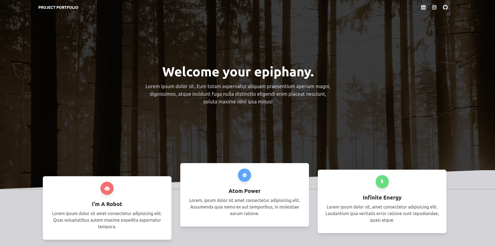

# react_tailwind_Animated Template: [LIVE DEMO](https://github.com/Shcoobz/react_tailwind_animated-template)

## Summary

react_tailwind_Animated Template provides a fully animated, responsive web application template built with React and Tailwind CSS. It features a user-friendly interface with rich animations that enhance the visual experience and engage users effectively.

The core functionality includes:

- Animated entrances and exits for all components.
- Responsive design that adapts to various device sizes.
- Interactive elements that provide a dynamic user experience.

## Features

### Animated Navigation

The navigation bar uses smooth animations for menu entry and exit, enhancing the user interaction and visual appeal.

### Dynamic Content Sections

Each section of the site includes unique animations that trigger as the user scrolls, providing a lively and engaging user experience.

### Contact Form with Validation

A fully functional contact form with animated input validation, ensuring user inputs are correctly formatted before submission.

### Additional Features

- Seamless integration with social media platforms.
- A dedicated about section with animated team member profiles.

## Technologies

- **React**: Utilized for its efficient rendering and state management capabilities.
- **Tailwind CSS**: Chosen for its utility-first approach, making responsive design straightforward and modular.
- **AOS (Animate On Scroll)**: Implements scroll-based animations to add interactivity and engagement.

---

_Note: This document provides an overview of react_Animated Template. For detailed instructions and more information, please refer to the source code documentation._

This project is a conversion from an earlier version built with vanilla JavaScript and HTML, available [here](https://github.com/Shcoobz/basicJS_tailwind_animated-template). This conversion integrates React to enhance UI reactivity and maintainability.
